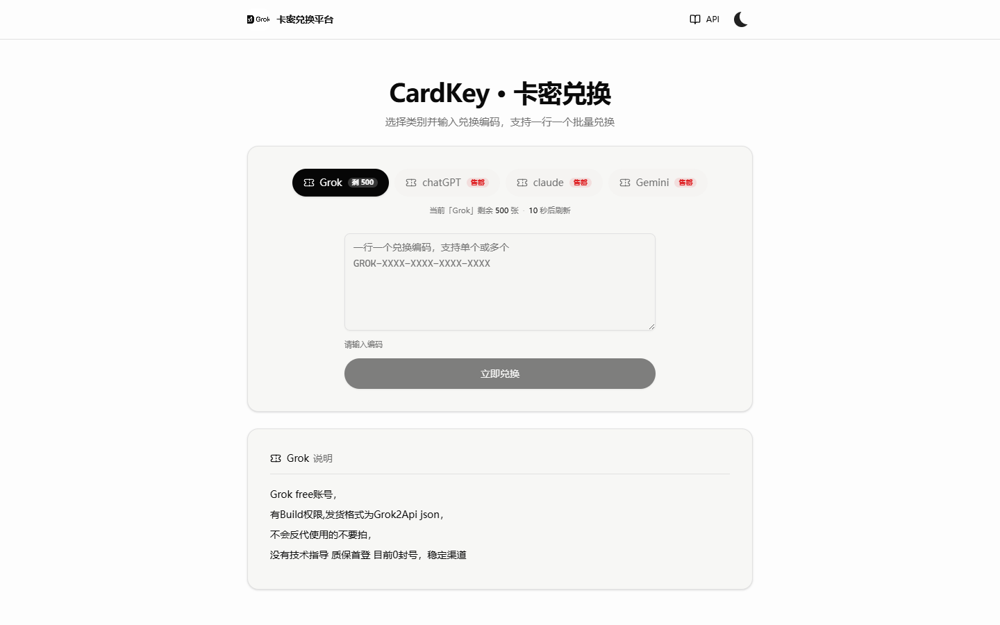
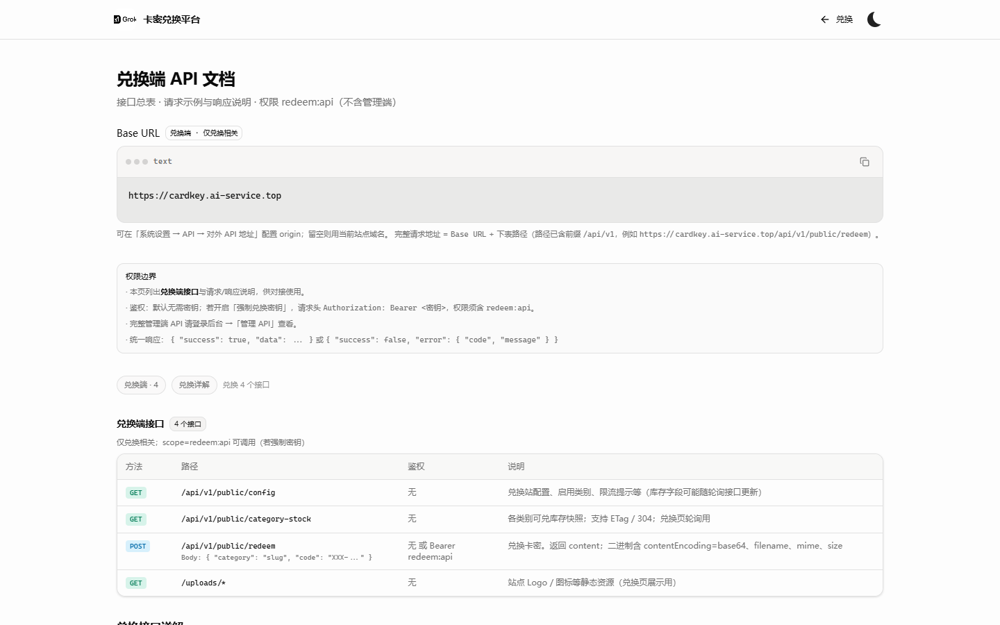
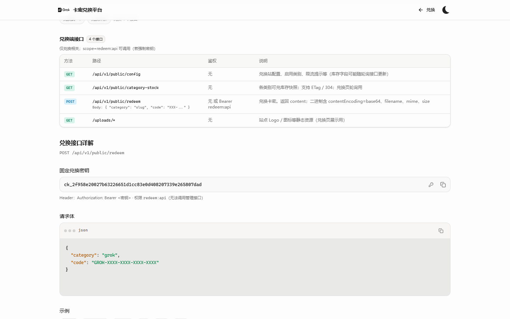
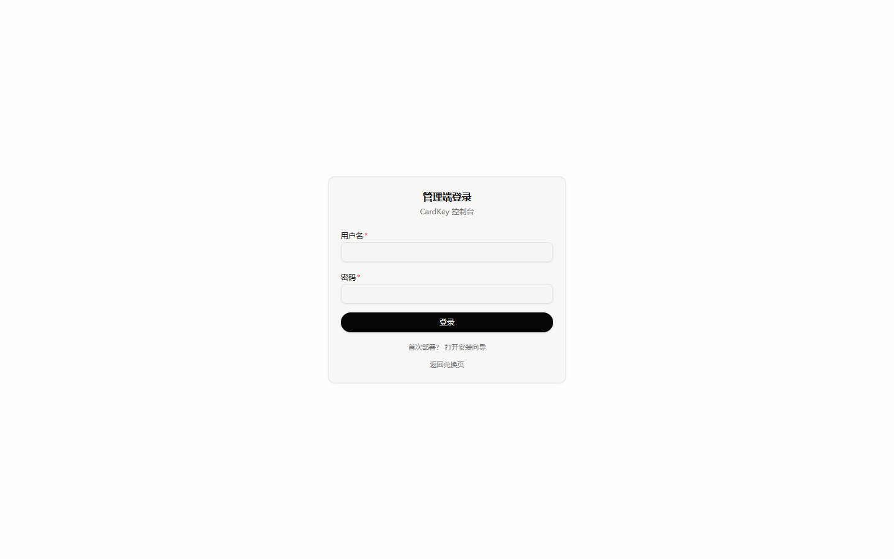

# CardKey

**Language:** [中文](README.md) · [English](README_EN.md)

Self-hosted card-key (gift code) redemption platform designed for high-concurrency workloads: public redeem UI, admin console, and a unified HTTP API.

[](https://go.dev/)
[](https://react.dev/)
[](https://www.postgresql.org/)
[](LICENSE)

| | |
|---|---|
| **Website** | [cardkey.ai-service.top](https://cardkey.ai-service.top/) |
| **Public API docs** | [cardkey.ai-service.top/docs](https://cardkey.ai-service.top/docs) |
| **Admin** | [cardkey.ai-service.top/admin](https://cardkey.ai-service.top/admin) |

---

## Screenshots

### Public redeem

| Single code | Batch |
|:---:|:---:|
|  |  |

Inventory is organized by category. Single and batch redemption are supported; results can be exported.

### API documentation

| Overview | Endpoint list |
|:---:|:---:|
|  |  |

Public `/docs` provides endpoint reference and multi-language request samples. The Base URL is the site origin; paths use the `/api/v1` prefix. The admin console includes full Admin API documentation.

### Admin



After setup, open `/admin` for categories, cards, batches, API keys, site settings, audit logs, and online updates.

---

## Features

### Product

- **Public redeem**: category navigation, single / batch redeem, ZIP export
- **Inventory**: create, bulk import, enable / disable / delete, batch tracking
- **Category isolation**: unique code prefixes; delete only when no redeem history, otherwise disable
- **API keys**: system redeem key and custom keys (revoke, delete, rotate; scoped permissions)

### Platform

- **Setup wizard**: first-run admin account and site name (no sample business data is seeded)
- **Branding**: Logo / Favicon upload; redeem page and site copy are configurable
- **API docs**: public `/docs` and admin docs; configurable public Base URL
- **Observability**: `/healthz`, `/readyz`, protected Prometheus `/metrics`

### Security and operations

- Production secret validation; CSRF checks for cookie-based admin sessions
- Setup advisory lock to reduce concurrent initialization races
- Card content encrypted at rest with AES-GCM; redeem keys are not exposed in public config by default
- Unsafe upload types (e.g. SVG) are rejected
- **Online updates** (Docker / binary): download full **Linux amd64/arm64** Release assets (backend + embedded SPA + SQL migrations). Pending migrations run on restart; **data volumes are not removed**

---

## Stack

| Layer | Technology |
|-------|------------|
| Frontend | React 19 · Vite · Tailwind CSS 4 · TanStack Query |
| Backend | Go · chi · pgx |
| Data | PostgreSQL 16 · Redis 7 |
| Deploy | Docker Compose |

---

## Deployment

### Requirements

- Docker 20+ / Docker Compose v2
- Linux, macOS, or Windows (Docker Desktop)
- `git` and `bash` (Git Bash on Windows)

### A) Interactive install (recommended)

```bash
git clone https://github.com/hkx1997/CardKey.git
cd CardKey
bash deploy/docker-deploy.sh
```

The installer prompts for ports and database password and checks host port conflicts.

```bash
# Non-interactive (CI / automation)
APP_PORT=19000 bash deploy/docker-deploy.sh --yes

# Regenerate / overwrite .env
bash deploy/docker-deploy.sh --reconfig
```

### B) Online install (Linux / macOS)

```bash
curl -fsSL https://raw.githubusercontent.com/hkx1997/CardKey/main/deploy/install-online.sh | bash
```

Default install directory: `~/cardkey`. Custom path:

```bash
CARDKEY_DIR=/opt/cardkey bash -c \
  'curl -fsSL https://raw.githubusercontent.com/hkx1997/CardKey/main/deploy/install-online.sh | bash'
```

Piped installs are typically non-interactive and use default ports (with automatic free-port selection on conflict). Prefer method A for interactive configuration.

### C) Manual

```bash
cp .env.example .env
# Set APP_PORT, POSTGRES_PASSWORD, JWT_SECRET, CONTENT_KEY, etc.
docker compose up -d --build
```

### Endpoints

| Surface | URL |
|---------|-----|
| Redeem | `http://<host>:<APP_PORT>/` (default port `18080`) |
| Admin | `http://<host>:<APP_PORT>/admin` |

### First-time setup

1. Open the admin console  
2. If no administrator exists, the app routes to **`/admin/setup`**  
3. Set admin credentials and site name  
4. Sign-in completes automatically after setup  

Alternatively, set `BOOTSTRAP_ADMIN_PASS` to create an admin on process start (automation only; use a strong password in production).

### Environment variables

| Variable | Default | Description |
|----------|---------|-------------|
| `APP_PORT` | `18080` | Application port |
| `POSTGRES_PORT` | `5432` | PostgreSQL host port |
| `REDIS_PORT` | `6379` | Redis host port |
| `POSTGRES_USER` / `POSTGRES_DB` | `cardkey` | Database user / name |
| `POSTGRES_PASSWORD` | — | Use a strong password in production |
| `JWT_SECRET` | — | Random string, length ≥ 32 |
| `CONTENT_KEY` | — | 64 hex chars (`openssl rand -hex 32`) for content encryption |
| `BOOTSTRAP_ADMIN_PASS` | empty | Empty = web setup wizard |

See [`.env.example`](.env.example) for the full template.

### Operations

```bash
docker compose ps
docker compose logs -f cardkey
docker compose down                 # stop services; keep volumes
bash scripts/upgrade.sh             # recommended upgrade: rebuild app only
bash scripts/recover-volume.sh      # recover if an empty Postgres volume was attached
```

**Do not** run `docker compose down -v` or prune Postgres volumes in production. See [`deploy/DATA_SAFETY.md`](deploy/DATA_SAFETY.md).

### Production checklist

1. Use strong `POSTGRES_PASSWORD`, `JWT_SECRET`, and `CONTENT_KEY`  
2. Terminate TLS at Nginx / Caddy (or equivalent); set `SECURE_COOKIE=true`  
3. Back up PostgreSQL regularly (`pg_dump`)  
4. Expose only required ports (app port or 443)  
5. Prefer `scripts/upgrade.sh` or in-app updates; never wipe data volumes for upgrades  

Maintainer release process: [`AGENTS.md`](AGENTS.md) and `scripts/release.sh` (Linux binaries with embedded SPA and migrations).

---

## Development

```bash
cd frontend && pnpm install && pnpm dev
cd backend && go run ./cmd/cardkey
cd frontend && pnpm test
cd backend && go test ./...
```

---

## API overview

Response envelope:

```json
{ "success": true, "data": {} }
```

```json
{ "success": false, "error": { "code": "...", "message": "..." } }
```

| Method | Path | Description |
|--------|------|-------------|
| GET | `/api/v1/public/config` | Public site config |
| GET | `/api/v1/public/setup-status` | Whether setup is required |
| POST | `/api/v1/public/setup` | Complete first-time setup |
| POST | `/api/v1/public/redeem` | Redeem |
| POST | `/api/v1/admin/auth/login` | Admin login |
| GET | `/healthz` · `/readyz` | Liveness / readiness |
| GET | `/metrics` | Prometheus metrics (protect in production) |

Authoritative reference: `/docs` on a running instance and the admin API docs page.

---

## License

[MIT](LICENSE)
